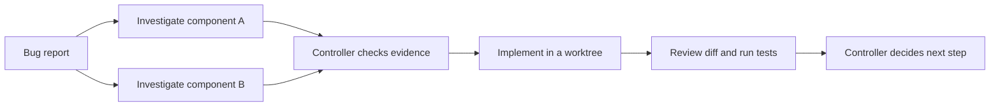

# Codex plugin for Claude Code

Use Codex from inside Claude Code for code reviews or to delegate tasks to Codex.

This fork of [openai/codex-plugin-cc](https://github.com/openai/codex-plugin-cc) adds
orchestration workers and shared-broker reliability fixes while keeping the existing
Claude Code review and delegation workflow.

<video src="./docs/plugin-demo.webm" controls muted playsinline autoplay></video>

## What You Get

- `/codex:review` for a normal read-only Codex review
- `/codex:adversarial-review` for a steerable challenge review
- `/codex:rescue`, `/codex:transfer`, `/codex:status`, `/codex:result`, and `/codex:cancel` to delegate work, hand off sessions, and manage background jobs
- [`codex:codex-worker`](#orchestrating-codex-workers) for schema-validated background workers, persistent sessions, steering, and lifecycle collection

## Requirements

- **ChatGPT subscription (incl. Free) or OpenAI API key.**
  - Usage will contribute to your Codex usage limits. [Learn more](https://developers.openai.com/codex/pricing).
- **Node.js 18.18 or later**

## Install

Add the marketplace in Claude Code:

```bash
/plugin marketplace add gregorydickson/codex-plugin-cc
```

Install the plugin:

```bash
/plugin install codex@codex-fork
```

Reload plugins:

```bash
/reload-plugins
```

Then run:

```bash
/codex:setup
```

`/codex:setup` will tell you whether Codex is ready. If Codex is missing and npm is available, it can offer to install Codex for you.

If you prefer to install Codex yourself, use:

```bash
npm install -g @openai/codex
```

If Codex is installed but not logged in yet, run:

```bash
!codex login
```

After install, you should see:

- the slash commands listed below
- the `codex:codex-rescue` and `codex:codex-worker` subagents in `/agents`

One simple first run is:

```bash
/codex:review --background
/codex:status
/codex:result
```

## Usage

### `/codex:review`

Runs a normal Codex review on your current work. It gives you the same quality of code review as running `/review` inside Codex directly.

> [!NOTE]
> Code review especially for multi-file changes might take a while. It's generally recommended to run it in the background.

Use it when you want:

- a review of your current uncommitted changes
- a review of your branch compared to a base branch like `main`

Use `--base <ref>` for branch review. It also supports `--wait` and `--background`. It is not steerable and does not take custom focus text. Use [`/codex:adversarial-review`](#codexadversarial-review) when you want to challenge a specific decision or risk area.

Examples:

```bash
/codex:review
/codex:review --base main
/codex:review --background
```

This command is read-only and will not perform any changes. When run in the background you can use [`/codex:status`](#codexstatus) to check on the progress and [`/codex:cancel`](#codexcancel) to cancel the ongoing task.

### `/codex:adversarial-review`

Runs a **steerable** review that questions the chosen implementation and design.

It can be used to pressure-test assumptions, tradeoffs, failure modes, and whether a different approach would have been safer or simpler.

It uses the same review target selection as `/codex:review`, including `--base <ref>` for branch review.
It also supports `--wait` and `--background`. Unlike `/codex:review`, it can take extra focus text after the flags.

Use it when you want:

- a review before shipping that challenges the direction, not just the code details
- review focused on design choices, tradeoffs, hidden assumptions, and alternative approaches
- pressure-testing around specific risk areas like auth, data loss, rollback, race conditions, or reliability

Examples:

```bash
/codex:adversarial-review
/codex:adversarial-review --base main challenge whether this was the right caching and retry design
/codex:adversarial-review --background look for race conditions and question the chosen approach
```

This command is read-only. It does not fix code.

### `/codex:rescue`

Hands a task to Codex through the `codex:codex-rescue` subagent.

Use it when you want Codex to:

- investigate a bug
- try a fix
- continue a previous Codex task
- take a faster or cheaper pass with a smaller model

> [!NOTE]
> Depending on the task and the model you choose these tasks might take a long time and it's generally recommended to force the task to be in the background or move the agent to the background.

It supports `--background`, `--wait`, `--resume`, and `--fresh`. If you omit `--resume` and `--fresh`, the plugin can offer to continue the latest rescue thread for this repo.

Examples:

```bash
/codex:rescue investigate why the tests started failing
/codex:rescue fix the failing test with the smallest safe patch
/codex:rescue --resume apply the top fix from the last run
/codex:rescue --model gpt-6.1-sol --effort medium investigate the flaky integration test
/codex:rescue --model spark fix the issue quickly
/codex:rescue --background investigate the regression
```

You can also just ask for a task to be delegated to Codex:

```text
Ask Codex to redesign the database connection to be more resilient.
```

**Notes:**

- if you do not pass `--model` or `--effort`, Codex chooses its own defaults.
- if you say `spark`, the plugin maps that to its fast, low-cost model alias (see `MODEL_ALIASES` in `plugins/codex/scripts/lib/models.mjs`)
- follow-up rescue requests can continue the latest Codex task in the repo

### `/codex:transfer`

Creates a persistent Codex thread from the current Claude Code session and prints a `codex resume <session-id>` command.

Use it when you started a debugging or implementation conversation in Claude Code and want to continue that same context directly in Codex.

Examples:

```bash
/codex:transfer
/codex:transfer --source ~/.claude/projects/-Users-me-repo/<session-id>.jsonl
```

The plugin's existing `SessionStart` hook supplies the current transcript path automatically; `--source` is available as a manual override. The transfer uses Codex's external-agent session importer, so it follows the same conversion rules as importing Claude history in the Codex App and creates visible turns that can be continued in the App or TUI. The source must be under `~/.claude/projects`, and older Codex versions that do not expose session import must be upgraded before using this command.

### `/codex:status`

Shows running and recent Codex jobs for the current repository.

Examples:

```bash
/codex:status
/codex:status task-abc123
```

Use it to:

- check progress on background work
- see the latest completed job
- confirm whether a task is still running

### `/codex:result`

Shows the final stored Codex output for a finished job.
When available, it also includes the Codex session ID so you can reopen that run directly in Codex with `codex resume <session-id>`.

Examples:

```bash
/codex:result
/codex:result task-abc123
```

### `/codex:cancel`

Cancels an active background Codex job.

Examples:

```bash
/codex:cancel
/codex:cancel task-abc123
```

### `/codex:setup`

Checks whether Codex is installed and authenticated.
If Codex is missing and npm is available, it can offer to install Codex for you.

You can also use `/codex:setup` to manage the optional review gate.

#### Enabling review gate

```bash
/codex:setup --enable-review-gate
/codex:setup --disable-review-gate
```

When the review gate is enabled, the plugin uses a `Stop` hook to run a targeted Codex review based on Claude's response. If that review finds issues, the stop is blocked so Claude can address them first.

> [!WARNING]
> The review gate can create a long-running Claude/Codex loop and may drain usage limits quickly. Only enable it when you plan to actively monitor the session.

## Typical Flows

### Review Before Shipping

```bash
/codex:review
```

### Hand A Problem To Codex

```bash
/codex:rescue investigate why the build is failing in CI
```

### Start Something Long-Running

```bash
/codex:adversarial-review --background
/codex:rescue --background investigate the flaky test
```

Then check in with:

```bash
/codex:status
/codex:result
```

## Codex Integration

The Codex plugin wraps the [Codex app server](https://developers.openai.com/codex/app-server). It uses the global `codex` binary installed in your environment and [applies the same configuration](https://developers.openai.com/codex/config-basic).

### Common Configurations

If you want to change the default reasoning effort or the default model that gets used by the plugin, you can define that inside your user-level or project-level `config.toml`. For example to always use `gpt-6.1-sol` on `high` for a specific project you can add the following to a `.codex/config.toml` file at the root of the directory you started Claude in:

```toml
model = "gpt-6.1-sol"
model_reasoning_effort = "high"
```

Your configuration will be picked up based on:

- user-level config in `~/.codex/config.toml`
- project-level overrides in `.codex/config.toml`
- project-level overrides only load when the [project is trusted](https://developers.openai.com/codex/config-advanced#project-config-files-codexconfigtoml)

Check out the Codex docs for more [configuration options](https://developers.openai.com/codex/config-reference).

### Moving The Work Over To Codex

Delegated tasks and any [stop gate](#what-does-the-review-gate-do) run can also be directly resumed inside Codex by running `codex resume` either with the specific session ID you received from running `/codex:result` or `/codex:status` or by selecting it from the list.

This way you can review the Codex work or continue the work there.

## FAQ

### Do I need a separate Codex account for this plugin?

If you are already signed into Codex on this machine, that account should work immediately here too. This plugin uses your local Codex CLI authentication.

If you only use Claude Code today and have not used Codex yet, you will also need to sign in to Codex with either a ChatGPT account or an API key. [Codex is available with your ChatGPT subscription](https://developers.openai.com/codex/pricing/), and [`codex login`](https://developers.openai.com/codex/cli/reference/#codex-login) supports both ChatGPT and API key sign-in. Run `/codex:setup` to check whether Codex is ready, and use `!codex login` if it is not.

### Does the plugin use a separate Codex runtime?

No. This plugin delegates through your local [Codex CLI](https://developers.openai.com/codex/cli/) and [Codex app server](https://developers.openai.com/codex/app-server/) on the same machine.

That means:

- it uses the same Codex install you would use directly
- it uses the same local authentication state
- it uses the same repository checkout and machine-local environment

The shared app-server broker shuts down after five minutes with no connected clients. Connected tasks can run for as long as needed; the next command restarts an expired broker automatically. Set `CODEX_COMPANION_BROKER_IDLE_TIMEOUT_MS` to a positive millisecond interval to change the idle timeout. Session-end hooks leave the shared broker running so other sessions can continue using it.

### Will it use the same Codex config I already have?

Yes. If you already use Codex, the plugin picks up the same [configuration](#common-configurations).

### Can I keep using my current API key or base URL setup?

Yes. Because the plugin uses your local Codex CLI, your existing sign-in method and config still apply.

If you need to point the built-in OpenAI provider at a different endpoint, set `openai_base_url` in your [Codex config](https://developers.openai.com/codex/config-advanced/#config-and-state-locations).

## Orchestrating Codex workers

This fork adds an opt-in worker interface for orchestrators. Use the
[`codex:codex-worker` subagent](plugins/codex/agents/codex-worker.md) when you want to
delegate a brief and receive a validated JSON result envelope, or call the companion
CLI directly for control over worker sessions and lifecycle events. These options
are exposed by the companion CLI; they are not automatically available on every
slash command.

### What this enables

The worker interface lets Claude or another controller delegate a bounded piece
of work, continue with other tasks, and collect a result it can process. The
controller can distinguish a completed result from a question, invalid output,
or a failed worker without interpreting a conversational transcript.

| Workflow | How the improvements help | What the controller still owns |
| --- | --- | --- |
| Review from several perspectives | Give security, correctness, and test reviewers separate briefs, then collect structured findings. Use separate workers or supported `--fanout` delegation. | Assign distinct responsibilities, reconcile duplicate or conflicting findings, and check the evidence. |
| Fix independent tickets in parallel | Give each writer its own Git worktree and inspect its `changedFiles` alongside the result. Token-aware external locks can coordinate writers that share a worktree. | Create worktrees, enforce ownership, run checks, resolve conflicts, and decide what to merge. |
| Keep an investigation across sessions | Name a background audit, leave the calling session, then inspect or resume its Codex thread later. | Collect each job's result and explicitly stop work that is no longer needed. |
| Ask for a decision without losing context | A worker can pause with a question, proposed answer, and source references; `answer` continues the same job and thread. | Route the question to a person or another agent and supply the decision. |
| Check competing conclusions | `compare` exposes field disagreements between Codex and a supplied peer; `verify-claims` checks statements against a pinned source revision. | Investigate disagreements and assess the verifier's evidence. Agreement alone does not establish correctness. |
| Drive a dashboard or follow-up stage | Result files provide durable collection, while socket events and hooks can notify a controller that work needs attention. | Implement the listener, deduplicate replayed terminal events, and decide whether to retry, escalate, or launch the next stage. |

These are building blocks for a workflow you define. The plugin does not
automatically create a ticket queue, assign an agent team, approve changes, or
merge pull requests. A valid JSON schema establishes the shape of a result;
tests and source evidence are still needed to establish that its conclusions are
correct.

### Example: investigate, implement, and verify a fix

For a bug spanning two components, a controller could start two read-only
investigators with the same bug report and different source files to inspect.
Each returns a structured hypothesis and supporting references. The controller
compares the findings, resolves any open question, and gives an implementation
worker a focused brief in a dedicated worktree. A separate reviewer then checks
the resulting diff and test evidence before the controller decides whether to
publish it.



If the implementation worker needs a product decision, `--pause-and-ask` gives
the controller an explicit handoff point. If it crashes, recovery records a
terminal outcome and attempts cleanup so the controller can inspect the work
before choosing a retry; recovery does not finish the task automatically.
Keeping a result file means a missed progress event need not lose the outcome.

### Worker capabilities

| Capability | What it provides |
| --- | --- |
| Structured results | `--output-schema` validates task and review output; `--result-file` writes a JSON envelope with status and validation diagnostics. |
| Explicit context | `--brief`, repeated `--instructions`, and repeated `--preread` attach the task and supporting files. |
| Model and runtime selection | Per-call `--model`, `--effort`, `--profile`, and `--mcp-config` select worker configuration. |
| Persistent sessions | `--name` or `--persistent` lets a worker outlive the calling Claude session; `sessions` lists, resumes, and stops named work. |
| Steering and questions | `send` steers an active turn; `--pause-and-ask` and `answer` let an orchestrator resolve a blocked worker's question. |
| Controlled writes | `--write --worktree` selects a Git worktree, with optional external lock/unlock commands and `changedFiles` reporting. |
| Lifecycle collection | Result files, Unix socket notifications, shell hooks, and a detached watchdog support collecting background work. |
| Comparison and verification | `compare` compares schema-valid peer results; `verify-claims` checks claims against source at a pinned Git revision. |
| Usage and fan-out | Token usage, quota-exhaustion errors, and `--fanout N` with cumulative child limits and completed child results expose supported Codex child-worker behavior. |

### Start a typed background worker

Set `C` to the companion's absolute path. From a clone of this repository:

```sh
C="$(pwd)/plugins/codex/scripts/codex-companion.mjs"
```

Inside an installed plugin's execution environment, use
`C="${CLAUDE_PLUGIN_ROOT}/scripts/codex-companion.mjs"` instead. Run the following
commands from the project you want Codex to inspect:

```sh
cat > brief.md <<'BRIEF'
Inspect this project's error handling without changing files.
Return a concise summary and a list of concrete findings.
BRIEF

cat > result.schema.json <<'SCHEMA'
{
  "type": "object",
  "properties": {
    "summary": { "type": "string" },
    "findings": { "type": "array", "items": { "type": "string" } }
  },
  "required": ["summary", "findings"],
  "additionalProperties": false
}
SCHEMA

node "$C" task --background --name audit --brief brief.md \
  --output-schema result.schema.json --result-file /tmp/audit-result.json --json
```

Replace `JOB_ID` below with the `jobId` returned by the launch command:

```sh
node "$C" status JOB_ID --wait --json
node "$C" result JOB_ID --json
```

A bounded wait can return while the worker is still running; repeat it as needed.
Treat the result as successful only when `status` is `completed` and `schemaValid`
is `true`. The envelope preserves invalid-output diagnostics and includes runtime
metadata such as `changedFiles`, `children`, and usage when available.

### Coordinate ongoing work

```sh
node "$C" sessions list --json
node "$C" send audit "Also inspect the empty-input case" --json
node "$C" sessions resume audit "Expand the completed review to cover retries" --background --json
```

`send` requires an active turn. Resuming a completed named session returns a new
job ID on the same Codex thread. A worker launched with `--pause-and-ask` can return
an `awaiting-answer` report; continue it with
`node "$C" answer JOB_ID "Your decision" --json` while retaining its job ID.

### Reliability and current limits

Concurrent callers now serialize shared broker startup. Ending one Claude session
leaves the shared broker available to other sessions, and the broker still reaps
itself after its idle timeout.

Terminal notifications and lock cleanup recover from process crashes. Replayed
terminal events carry a stable `deliveryId` (`CODEX_JOB_DELIVERY_ID` for hooks);
consumers must deduplicate that ID atomically with their side effect. External lock
commands must use the supplied ownership token and support idempotent release and
cancellation of pending acquisition. See the guide for the complete lock contract.
Progress notifications are best effort and coalesced; keep a result file for collection.

Snapshots run inside each lock segment and accumulate across pause/answer. Explicit
worktree accounting fails when its 10,000-entry / 64 MiB content budget is exceeded.
Comparison peer output has a combined 1 MiB stdout/stderr limit.

Private job state retains resolved configuration for resumption; protect that directory.
Public status/session output excludes that configuration and executable commands.
Profile network allowlists cover sandboxed command traffic, not hosted web tools,
apps, or MCP server networking. MCP availability, network policy enforcement, and
child-worker support depend on the installed Codex runtime. Parent token usage does
not include child usage or estimate dollar cost.

See the [worker CLI guide](plugins/codex/docs/workers.md) for configuration formats,
notification events, worktree locking, comparison inputs, claim verification, and
runtime requirements.
